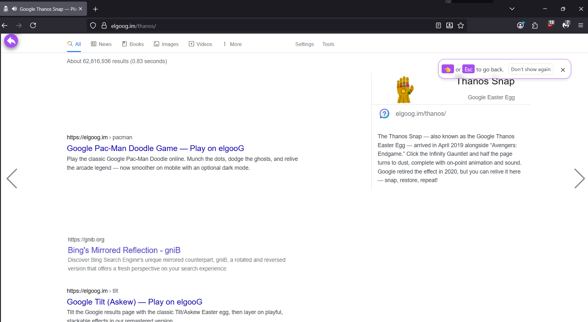
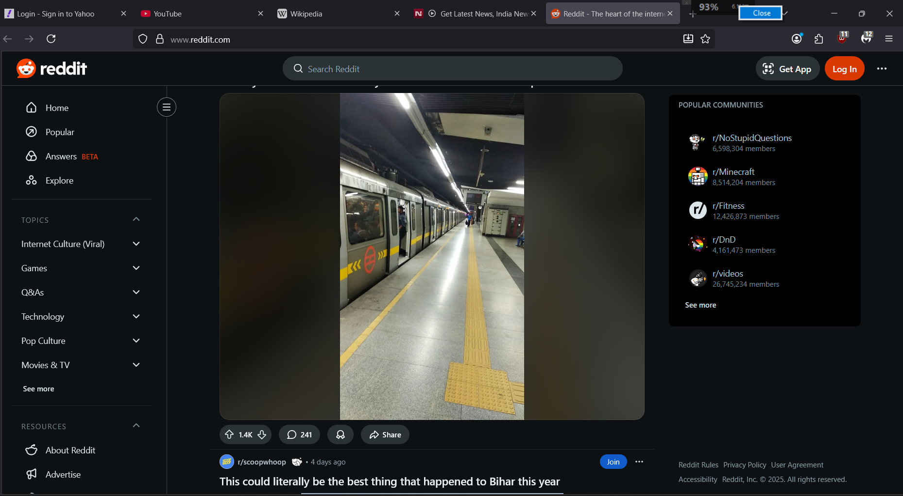

# 🐧 BatteryPenguine - A Lightweight System Monitor Overlay

**BatteryPenguine** is a simple, lightweight desktop widget that provides a real-time overlay for monitoring your system's key metrics, including **battery status** and **network speed**. It's designed to be unobtrusive, always on top, and easily collapsible.

---

## 📸 Screenshots

A quick look at the **BatteryPenguine** widget in action.

| On Charging (Green Text) | Off Charging (White Text) |
| :---: | :---: |
|  |  |

| Collapsed View | Right-Click to Close |
| :---: | :---: |
|  |  |

---

## 📖 Table of Contents

- [✨ Features](#-features)
- [⚙️ Installation](#-installation)
- [🚀 Usage](#-usage)
- [🐼 Development Version: BatteryPanda](#-development-version-batterypanda)
- [🤝 Contributing](#-contributing)
- [📄 License](#-license)

---

## ✨ Features

-   **🔋 Real-time Monitoring:**
    -   **Battery:** Displays current percentage and charging status.
    -   **Network Speed:** Shows the network Speed.
-   **💡 Minimalist UI:**
    -   **Collapsible:** Minimize the widget with a single click.
    -   **Always-on-Top:** Stays visible over all other windows.
    -   **Lightweight:** Uses minimal system resources.

---

## ⚙️ Installation

### For Users (Recommended)

1.  Go to the **Releases** page of this repository.
2.  Download the latest **BatteryPenguine.exe** file.
3.  Run the downloaded file to launch the application. Optionally, you can configure it to start automatically with your system.

### For Developers (Running from Source)

**Prerequisites:**

* Python 3.x
* Pip

**Installation:**

1.  Clone the repository:
    ```bash
    git clone [https://github.com/shalinchristian/BatteryPenguine.git](https://github.com/shalinchristian/BatteryPenguine.git)
    ```
2.  Navigate to the project directory:
    ```bash
    cd BatteryPenguine
    ```
3.  Install the required packages:
    ```bash
    pip install -r requirements.txt
    ```

---

## 🚀 Usage

1.  From the project's root directory (`BatteryPenguine/`), run the application as a module:
    ```bash
    python -m src.batterypenguine.main
    ```
2.  Right-click the widget to close the application.
3.  Click the toggle button on the left to collapse or expand the widget.

---

## 🤝 Contributing

Contributions are welcome! Please read the [CONTRIBUTING.md](CONTRIBUTING.md) file for details on our code of conduct and the process for submitting pull requests.

---

## 📄 License

This project is licensed under the MIT License - see the [LICENSE](LICENSE) file for details.
